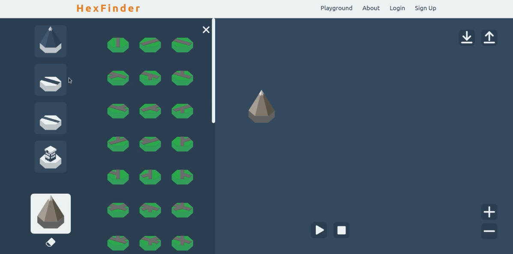
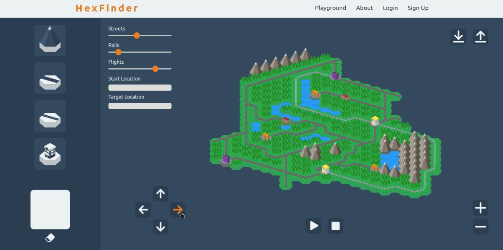
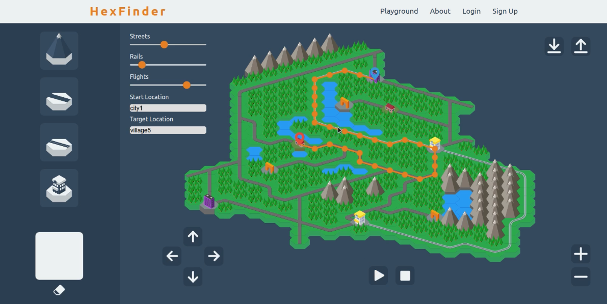

# HexFinder v1
HexFinder is an App for playful pathfinding. It combines pathfinding with an hexadiagonal grid.
 
 

## Map Editor
HexFinder offers a map editor where you can build your map using hex tiles.
You can choose between nature, street, rail, and city tiles.
The streets and rails connect the cities and sights.
Cities can be reached by car, train and also plane, whereas towns can be reached by car or train.
Villages can only be reached by car.
 
 

 
 
Here we can see an example of a built map. We have 2 cities, 2 towns, 2 villages and 3 sights connected with each other.
 
 

## Pathfinding
Behind the scenes a graph is build containing all the infrastructure of our map. And by choosing a starting point and a target the pathfinding algorithm calculates the shortes route based on the values of the slider. The slider determine how fast each transportation is. The more left a slider is, the faster our vehicle will be.
 
Here you can see the first route.
 
 

 
 
Now that the rails slider is more to the right than before our shortest path is changing.
 
 

 
 
If we change the weight of the flights to a lower number you can see that it is proposed to take the plane.
 
 
